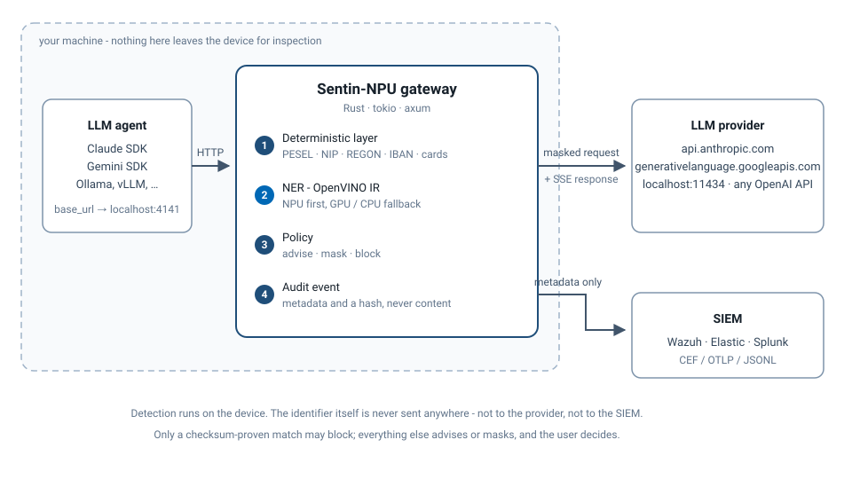

# Sentin-NPU

**Local AI privacy gateway on Intel® NPU - advisory DLP for LLM agents with SIEM audit trail (OpenVINO™)**

Sentin-NPU sits between your LLM agents (Claude, Gemini, local models via Ollama)
and their APIs. Before a prompt leaves the device, it detects sensitive data
(PII, corporate identifiers) **locally on the NPU**, advises the user or masks
the data, and emits an audit event to your SIEM. Advisory by design - it blocks
only on unambiguous policy violations.

> ⚠️ **Status: Proof of Concept.** Not production-ready. See [Roadmap](#roadmap).
>
> Versions are `0.x`, and that is the honest signal rather than a formality: layer 2 can still fail
> to load and leave the checksum detectors carrying the load, response-side masking does not exist,
> and the Windows installer has not yet been walked through by anyone but its author.
>
> Working today, end to end: the proxy with adapters for all three provider APIs, both detection
> layers - deterministic checksums *and* NER inference through OpenVINO - request masking and
> blocking, SIEM audit events over CEF/OTLP/JSONL, and release bundles that install on a machine
> with no Rust and no Python.
>
> **Verified on an Intel NPU as of 2026-08-09** - one machine, a Core Ultra 7 258V, where the
> model runs on the NPU at 78.21 mJ per inference against 724.14 mJ on that machine's CPU, at a
> realistic 10 requests per second. The
> development machine has an AMD NPU that OpenVINO cannot address, so everything else here is
> measured on CPU and every NPU claim rests on that single box - more reports welcome, see
> [Help wanted](#help-wanted-npu-reports). Response-side masking is not implemented; responses are
> inspected and logged, not rewritten.

[](https://github.com/GrzegorzOle/Sentin-NPU/actions/workflows/rust.yml)
[](https://github.com/GrzegorzOle/Sentin-NPU/actions/workflows/python.yml)
[](https://github.com/GrzegorzOle/Sentin-NPU/releases)
[](LICENSE)

---

## Why

- Employees and AI agents leak sensitive data into cloud LLMs - classic DLP
  tools don't see this traffic in a usable way.
- Cloud-based DLP inspection creates the very problem it solves: your data
  leaves the device to be checked.
- Modern AI PCs ship with an NPU that is mostly idle. Low-power, always-on,
  on-device inference is exactly what a privacy gateway needs.
- EU organizations under **NIS2** must demonstrate risk management and incident
  reporting - "prompt leakage" events are currently invisible to most SOCs.

## Architecture



The gateway itself is **Rust** (`gateway/`, a Cargo workspace: `sentin-core`, `sentin-detect`,
`sentin-proxy`, `sentin-audit`) - that is what gets deployed. **Python** (`tools/`) is the offline
model toolchain that converts and quantizes the NER model; it is never in the request path.

**Design principles**

1. **On-device only** - no content ever leaves the machine for inspection.
2. **Advisory first** - the user decides; hard blocks are reserved for
   deterministic, unambiguous violations (e.g. a valid credit card number).
3. **Audit without content** - SIEM events carry metadata (data type, target
   app, decision, hash), never the sensitive text itself.
4. **The device is measured, not assumed** - `AUTO` compiles and times the model
   on every device OpenVINO enumerates, rejects any that cannot hold the
   inference budget, and prefers the cheapest of the rest (NPU, then integrated
   GPU, then CPU). Enumeration only proves a device exists: a discrete card
   reached through the OpenCL ICD ran the same model 26x slower than the CPU
   beside it. Fallback stays transparent, and the device that actually executed
   is logged and carried in every audit event.

## Quick start

### Installers - one file, everything inside

**Windows.** [`sentin-npu-setup-<version>.exe`](https://github.com/GrzegorzOle/Sentin-NPU/releases/latest)
carries the gateway, the OpenVINO runtime, the model, the diagnostics and the Wazuh integration.
The wizard asks for the port, the bind address, the upstreams and the audit path, writes
`config.yaml` from the answers, and installs a Windows service that starts at boot. Nothing is
downloaded during installation. Details, silent installation and service commands:
[`packaging/windows/`](packaging/windows/README.md).

**Linux.** `Sentin-NPU-<version>-x86_64.AppImage` is one executable that runs on any x86-64
distribution with glibc 2.31 or newer:

```bash
chmod +x Sentin-NPU-*.AppImage
./Sentin-NPU-*.AppImage --setup            # asks what it needs, writes the configuration
./Sentin-NPU-*.AppImage --install-service  # optional: a systemd user unit
./Sentin-NPU-*.AppImage                    # run it
```

No Python, no Rust, no OpenVINO installation. Details:
[`packaging/linux/`](packaging/linux/README.md).

**The documentation travels with the software.** Every archive carries `docs/` and `wazuh/`; the
AppImage hands them over with `--docs`; the Windows installer puts them under the program directory
with Start Menu entries. `sentin-npu-docs-<version>.zip` on the releases page is the same material
on its own, 160 KB, for reading before a 280 MB download and for handing to whoever runs your SIEM.

### From a release bundle - no toolchain needed

The bundle carries the gateway, the diagnostics, the latency harness, the OpenVINO runtime and the
quantized model. Nothing else is required: no Rust, no Python, no OpenVINO installation. `./run.sh`
collects a device report and pipeline latency for NPU, GPU and CPU into one archive.

The bundle filename carries the release version, so the commands below read the newest tag rather
than hard-coding one - a pasted version number here goes stale the day the next release lands, and
has done.

```bash
# Linux x64
REPO=GrzegorzOle/Sentin-NPU
TAG=$(curl -fsSL "https://api.github.com/repos/$REPO/releases/latest" \
        | sed -n 's/.*"tag_name": *"\([^"]*\)".*/\1/p')
BUNDLE="sentin-npu-diag-${TAG#v}-linux-x64.tar.gz"

curl -LO "https://github.com/$REPO/releases/download/$TAG/SHA256SUMS.txt"
curl -LO "https://github.com/$REPO/releases/download/$TAG/$BUNDLE"
sha256sum -c SHA256SUMS.txt --ignore-missing

tar xzf "$BUNDLE"
cd "${BUNDLE%.tar.gz}"

./run.sh              # every diagnostic, both shape variants, collected into one archive
./install.sh          # → ~/.local/share/sentin-npu, wrappers in ~/.local/bin

sentin-gateway ~/.local/share/sentin-npu/config.yaml
```

`packaging/systemd/` holds a **user** unit if you want it running as a service. The Windows zip is
built by the same CI job, carries the same three binaries as the Linux bundle, and **was executed
end to end on Windows 11 on 2026-08-31**: it runs with no toolchain present, collects the device
report and measures pipeline latency per device. On that machine OpenVINO enumerated a discrete
NVIDIA card through the OpenCL ICD and ran the model at 224.8 ms against 8.7 ms on the CPU, which
is the measurement behind device selection being by timing rather than by a fixed order. Energy
remains Linux-only: Windows has no RAPL sysfs.

### Just the model

The quantized IR is also published on its own, for loading from your own code or comparing against
your own conversion. Both archives carry the tokenizer, the label map, the attribution required by
the model's CC-BY-4.0 licence, and a README covering the two traps that catch people loading this
IR by hand. **These names have no version in them**, so the URL below keeps working across
releases; `SHA256SUMS.txt` pins the bytes for whichever release you took them from.

```bash
curl -LO https://github.com/GrzegorzOle/Sentin-NPU/releases/latest/download/sentin-npu-model-herbert-int8-seq128.tar.gz
tar xzf sentin-npu-model-herbert-int8-seq128.tar.gz
```

**Quantizing it yourself will not give you these exact weights.** NNCF calibrates over sampled
data, so every run produces a slightly different INT8 model - worth about ±0.2 pp of F1 in
measurements here. The published archive is one such quantization; if you need the numbers in
`docs/benchmarks.md` to line up with what you are running, take the archive rather than rebuilding.

`seq128` is the default and the shape every published latency figure was measured at; a `seq512`
archive is published beside it for longer inputs. Point `inference.model_dir` at the extracted
directory - as an **absolute** path, or it resolves against the working directory and layer 2
quietly stays down. The release bundles keep their own embedded copy, so you do not need this to
run one.

### From source

The project is hybrid by design: **Python is the offline model toolchain, Rust is the gateway
runtime that ships.** The two steps below reflect that split.

```bash
git clone https://github.com/GrzegorzOle/Sentin-NPU.git
cd Sentin-NPU

# 1. Model toolchain (Python 3.11+, offline) - produces the OpenVINO IR
python3.11 -m venv tools/.venv
tools/.venv/bin/pip install -r tools/requirements.txt
tools/.venv/bin/python tools/prepare_model.py --model herbert   # HF → IR, static shapes 128 and 512
tools/.venv/bin/python tools/quantize.py      --model herbert   # → INT8
# Or skip both: unpack the published IR into models/herbert/int8/seq128 instead (see "Just the
# model" above). Step 1 documents how the model was made; it does not reproduce it byte for byte
# -- INT8 calibration samples data, so your weights will differ slightly from the published ones.

# 2. Gateway (Rust, edition 2021, MSRV 1.82).
#    The Cargo workspace lives in gateway/, so build it by manifest path and run the
#    binary from the repo root, where config/ and models/ resolve.
cargo build --release --manifest-path gateway/Cargo.toml

# The OpenVINO runtime is loaded with dlopen at startup, so it has to be on the library
# path. The Python wheel installed above already carries it -- including the NPU plugin.
export OVLIB=$PWD/tools/.venv/lib/python3.11/site-packages/openvino/libs
export LD_LIBRARY_PATH=$OVLIB:$LD_LIBRARY_PATH

./gateway/target/release/sentin-gateway config/default.yaml
```

`dlopen` looks for **unversioned** sonames (`libopenvino_c.so`) and the wheel ships only versioned
ones (`libopenvino_c.so.2630`). If startup fails with *"Unable to find the `openvino_c` library to
load"*, create the symlinks:

```bash
for f in "$OVLIB"/*.so.*; do ln -sf "$f" "${f%%.so.*}.so"; done
```

Without a loadable runtime the gateway still starts - it logs the failure and inspects with
layer 1 only, because a proxy in the path of real work should not refuse to run over a missing
optional component.

The listen address comes from the config file (`listen.host` / `listen.port`, default
`127.0.0.1:4141`). Port 4000 is deliberately avoided: LiteLLM and similar model routers commonly sit there.

Useful extras:

```bash
tools/.venv/bin/python tools/devices.py       # which OpenVINO devices this machine really has
tools/.venv/bin/python tools/validate_model.py --model herbert --seq 128 --dataset wikiann
./gateway/target/release/sentin-gateway --doctor --json my-machine.json  # device report
./gateway/target/release/sentin-bench             # latency (M2a, M2c)
./gateway/target/release/sentin-bench --energy    # energy overhead (M5b)
```

Point your agent at the gateway:

```bash
# Anthropic SDK
export ANTHROPIC_BASE_URL=http://localhost:4141/anthropic

# OpenAI-compatible (Ollama, LM Studio, vLLM)
export OPENAI_BASE_URL=http://localhost:4141/openai
```

For Google GenAI the gateway serves `/google/*`; the SDK has no standard base-URL environment
variable, so pass `http://localhost:4141/google` as the client's endpoint/base-URL option.

Your API key is forwarded upstream unchanged and is never written to a log - the gateway is a
proxy, not a credential broker.

## Detection layers

| Layer | What it catches | Method | Verdict allowed |
|---|---|---|---|
| 1. Deterministic - checksum | PESEL (with its embedded date), NIP (bare or as `PL...`), REGON, IBAN, payment cards | single-pass scan + checksum | advise / mask / **block** |
| 1. Deterministic - pattern | email, Polish phone numbers, other EU VAT numbers | shape only, no checksum | advise / mask - **never block** |
| 2. NER | names, organizations, locations | token classification, OpenVINO IR | advise / mask |
| 3. Corporate policy | company secrets, project codenames | signed policy artifacts (see Roadmap) | - planned |

The split inside layer 1 is enforced in the type system, not by configuration. Blocking a request
needs arithmetic proof, so a detector with no checksum behind it cannot reach that verdict even if
an operator configures `mode: block` for it - the request is masked instead.

## How the proxy works

The gateway is a **reverse proxy that speaks each provider's own API**. You do not change your
agent's code - you change its base URL, and the gateway forwards to the real upstream with the
request body inspected and, where policy says so, rewritten.

### Routing

One prefix per provider. The prefix is stripped and the rest of the path, plus the query string, is
appended to that provider's upstream:

| You call | Goes to |
|---|---|
| `POST http://127.0.0.1:4141/anthropic/v1/messages` | `https://api.anthropic.com/v1/messages` |
| `POST http://127.0.0.1:4141/openai/v1/chat/completions` | `http://localhost:4000/v1/chat/completions` |
| `POST http://127.0.0.1:4141/google/v1beta/models/gemini-2.0-flash:generateContent` | `https://generativelanguage.googleapis.com/v1beta/…` |
| `GET  http://127.0.0.1:4141/healthz` | answered locally with `ok` |

So pointing an agent at it is a one-line change:

```bash
export ANTHROPIC_BASE_URL=http://127.0.0.1:4141/anthropic
export OPENAI_BASE_URL=http://127.0.0.1:4141/openai/v1
```

A path matching no configured prefix gets **404**; an upstream that cannot be reached gets **502**.

### Authentication is the caller's, not the gateway's

**The gateway holds no credentials and needs none.** Whatever your agent already sends is passed
to the upstream unchanged, so the provider sees your key and your account:

- `authorization`, `x-api-key` and `x-goog-api-key` are relayed **verbatim**. Tests assert both
  halves of that: the mock upstream receives the exact value, and the header name never appears in
  a log line.
- **Query-string keys work too** - Google's `?key=…` - because the query is appended to the
  upstream URL untouched.
- `proxy-authorization` is deliberately **not** forwarded. It is hop-by-hop by the HTTP spec and
  belongs to the proxy hop itself, not to the upstream.

Billing, quotas and rate limits therefore stay attached to your own key, and rotating it needs no
change here. The audit trail records the upstream **host** and never the full URL, precisely
because a query string can carry both keys and content.

One caveat follows from there being no TLS on the listening side: between the agent and the gateway
the key travels in clear. On loopback that is the same trust boundary as the process itself - but
it stops being so the moment `listen.host` is bound to anything other than `127.0.0.1`.

### What the gateway does and does not touch

- **Credentials pass through verbatim.** `authorization` and `x-api-key` are forwarded unchanged
  and never logged - the gateway is a proxy, not a credential broker, so it needs no API keys of
  its own and your billing and rate limits stay yours.
- **Headers** are relayed except hop-by-hop ones, `host` and `content-length`. The method is
  preserved.
- **Only parseable JSON bodies are inspected.** Anything else - a different content type, a body
  that will not parse - is forwarded untouched rather than rejected. A proxy in the path of real
  work must not fail closed on a shape it does not recognise.
- **Unknown fields survive.** Adapters locate text by JSON pointer instead of deserialising into a
  common struct, so provider extensions the gateway has never heard of are forwarded exactly as
  written; only the text at the located positions is rewritten when masking.
- **No upstream timeout.** A streamed completion legitimately runs for minutes, so the proxy call
  does not get to be the thing that gives up. Inspection has its own timeout, below.

Two limits worth knowing: the request body is **read fully into memory** before forwarding, and
there is **no TLS on the listening side** - the agent-to-gateway hop is plaintext on loopback.
Both are fine for a local PoC and both are on the roadmap.

### Defaults

Shipped in [`config/default.yaml`](config/default.yaml); every section has a default, so a partial
file is valid and a missing one still yields a working gateway with layer 1 only.

| Setting | Default | Why |
|---|---|---|
| `listen.host` | `127.0.0.1` | loopback - putting a privacy gateway on the LAN should be a deliberate act |
| `listen.port` | `4141` | **not 4000**: LiteLLM and similar routers commonly hold that port |
| `providers.anthropic.upstream` | `https://api.anthropic.com` | |
| `providers.openai.upstream` | `http://localhost:4000` | any OpenAI-compatible upstream - LiteLLM, Ollama on `:11434`, LM Studio, vLLM |
| `providers.google.upstream` | `https://generativelanguage.googleapis.com` | |
| `inference.device` | `AUTO` | tries NPU → GPU → CPU, and logs which one actually ran |
| `inference.model_dir` | `models/herbert/int8/seq128` | the directory holding the IR **and** `tokenizer.json`; must be absolute once installed |
| `inference.timeout_ms` | `250` | ceiling on inspection, not on the upstream call |
| `inference.timeout_policy` | `fail_open` | advisory-first: a slow model must not become an outage |
| `inspect.request` | `true` | data leaving the device is the threat model |
| `inspect.response` | `false` | responses are inspected and audited, never rewritten (roadmap) |
| `inspect.stream_strategy` | `passthrough` | +0.1 ms to first token; see B2 in the benchmarks |
| `audit.jsonl` | on, `./sentin-audit.jsonl` | |
| `audit.syslog_cef` | off, `127.0.0.1:514` UDP | |
| `audit.otlp` | off, `http://localhost:4318` | OTLP over HTTP+JSON, so the **4318** port, not gRPC's 4317 |

Detector verdict ceilings ship as:

```yaml
detectors:
  pesel:        { layer: deterministic, mode: block }
  iban:         { layer: deterministic, mode: block }
  payment_card: { layer: deterministic, mode: block }
  nip:          { layer: deterministic, mode: mask }
  regon:        { layer: deterministic, mode: mask }
  email:        { layer: deterministic, mode: advise }
  phone_pl:     { layer: deterministic, mode: advise }
  person:       { layer: ner, mode: advise }
  organization: { layer: ner, mode: advise }
  location:     { layer: ner, mode: observe }
```

`mode` is a **ceiling, not an instruction**, and it is clamped twice: by the layer, and by the
evidence behind the individual finding. Setting `mode: block` on `email` yields masking, because
email has no checksum to prove itself with. A detector absent from this map defaults to `observe`,
so adding one in code can never silently start blocking traffic.

The config path is the first argument, falling back to `config/default.yaml` relative to the
working directory. A **missing** file is an error and the gateway exits - the per-section defaults
above fill in what a *partial* file leaves out, they are not a substitute for having one:

```bash
sentin-gateway                         # reads ./config/default.yaml
sentin-gateway /etc/sentin/gateway.yaml
```

### On Windows

The Windows bundle carries the same binaries and the same `config.yaml`, but **no installer** -
`install.sh` is Linux-only, and rewriting the config for you is exactly what it does. Three
consequences follow, and all three fail *quietly*:

**1. The OpenVINO DLLs are found through `PATH`.** `run.ps1` prepends the bundle's `lib\` for the
duration of its own run and nothing else does. Start `sentin-gateway.exe` yourself without it and
the runtime cannot be loaded - the gateway still starts, with layer 1 only, logging a warning that
is easy to lose in a startup log.

**2. `inference.model_dir` ships relative** (`models/seq128`) and resolves against the working
directory, so layer 2 loads only when you start from inside the bundle. Make it absolute; forward
slashes are fine, Rust accepts them on Windows.

**3. `audit.jsonl.path` is relative too** (`./sentin-audit.jsonl`) and lands in the working
directory. Under `Program Files` that is not writable - and an emitter that cannot write is logged
and skipped rather than failing the request, so this one is silent by design.

```powershell
powershell -ExecutionPolicy Bypass -File run.ps1    # diagnostics, no setup needed

# running the gateway itself
$env:PATH = "$PWD\lib;$env:PATH"
notepad config.yaml     # model_dir: C:/Users/you/sentin-npu/models/seq128
                        # audit.jsonl.path: C:/Users/you/sentin-npu/audit.jsonl
.\sentin-gateway.exe config.yaml
```

Binding to `127.0.0.1` raises no firewall prompt. **No service wrapper is provided** -
`packaging/systemd/` is Linux-only; use Task Scheduler or a shim such as NSSM. Energy measurement
does not work here at all: Windows has no RAPL sysfs, so `--power` reports it as unsupported and
M5 belongs on the Linux side.

> **None of this has been executed.** The Windows bundle builds, packs and passes CI, and nobody has
> yet run it on Windows. The steps above are read off the code and the bundle contents, not off a
> session on the platform - corrections are welcome as an
> [npu-report issue](https://github.com/GrzegorzOle/Sentin-NPU/issues/new?template=npu-report.yml).

## NPU inference

<!-- The core of the project for the OpenVINO community - keep this section honest and detailed -->

- **Model: [`pczarnik/herbert-base-ner`](https://huggingface.co/pczarnik/herbert-base-ner)**
  (CC-BY-4.0, commercial use permitted). Chosen over a multilingual XLM-R candidate on measured
  quality, size and tokenizer availability - see [docs/benchmarks.md](docs/benchmarks.md).
- Conversion: `optimum-intel` → OpenVINO IR, **static shapes** (sequence 128 and 512; static is an
  NPU requirement, not an optimisation), INT8 via NNCF post-training quantization.
- Rust binding: the [`openvino`](https://crates.io/crates/openvino) crate with `runtime-linking`.
- Inference runs on its own OS thread, reached by channel, with a configurable timeout. Blocking
  inference on a tokio worker would stall every request that shares it, and a model that fails to
  load leaves layer 1 running rather than taking the gateway down.
- Tested on: AMD Ryzen AI 7 350 / Fedora (CPU + NVIDIA dGPU via OpenCL), and on an **Intel Core
  Ultra 7 258V / Ubuntu 26.04, where the model runs on the NPU** - see below.

Measured with `--doctor` on the dev machine (HerBERT INT8, sequence 128):

| Device | Compile | First inference | Steady |
|---|---|---|---|
| CPU - AMD Ryzen AI 7 350 | 536 ms | 14.1 ms | **11.8 ms** |
| GPU - NVIDIA dGPU via OpenCL | 672 ms | 121.4 ms | 115.8 ms |


The NPU row is empty because this machine has no NPU that OpenVINO can address - that is a fact
about the development hardware, not about the model. The Intel measurements that fill it are
below.

### Benchmarks

Full detail, methodology and caveats: **[docs/benchmarks.md](docs/benchmarks.md)**.

Model quality (WikiANN, 500 sentences per language, exact span match, PER/ORG/LOC):

| Model | Licence | F1 PL | F1 EN | INT8 size |
|---|---|---|---|---|
| `herbert-base-ner` FP32 | CC-BY-4.0 | **88.06** | 58.97 | - |
| `herbert-base-ner` INT8 | | **87.57** | 59.51 | 123 MB |
| `xlm-roberta-base-ner-hrl` INT8 | AFL-3.0 | 62.62 | 53.36 | 284 MB |

INT8 figures come from one quantization. NNCF calibrates over sampled data, so a rebuild produces
slightly different weights - **±0.2 pp F1 is the reproducibility floor**, and the published archive
scores 87.75 PL where the locally rebuilt model scores 87.57.

Gateway cost, measured against a local mock upstream so the figures are the gateway's own and not
the network's:

| Metric | Result |
|---|---|
| Deterministic layer throughput | 296 MB/s - 1.22 GB/s |
| Proxy overhead, p95 (no inspection) | **+0.07 ms** |
| Full pipeline overhead, p95 (layer 1 + NER on CPU) | **+10.8 ms** - one inference, and little else |
| Streaming time-to-first-token | +0.1 ms (`passthrough`) · +92 ms (`sliding_window`) · +511 ms (`buffer`) |
| Energy overhead | **+0.57 mJ per request** (≈ 5.7 mW at 10 rps, AMD dev machine) |
| INT8 quality loss | ≤ 0.9 pp F1 |
| Resident memory | 9 MB without the model · 506 MB with it |
| False positives on 1 MB of PII-free prose | 0 |

The Rust engine and the Python reference toolchain are scored against each other on every run of
the test suite; they agree to two decimal places (95.52 PL / 84.44 EN on the committed fixtures).
That is a parity check, not a quality claim - the WikiANN figures above are the honest measure.

Per-device inference latency and power - the NPU-vs-GPU-vs-CPU comparison this project exists to
produce. Measured 2026-08-09 on one **Intel Core Ultra 7 258V** (Lunar Lake, Ubuntu 26.04), all
three devices on the same machine, HerBERT INT8 sequence 128:

Energy is the median of five repeats after a discarded warm-up, at the load a gateway in front of
a few agents actually sees - **10 requests per second**, not saturation.

| Device | Steady inference | Added p95 (full pipeline) | Above-idle power @10 rps | Energy per inference @10 rps |
|---|---|---|---|---|
| NPU - Intel AI Boost | 5.9 ms | +3.85 ms | **0.78 W** | **78.21 mJ** |
| GPU - Intel Arc 140V (iGPU) | 2.7 ms | +3.09 ms | 1.53 W | 160.08 mJ |
| CPU - Core Ultra 7 258V | 23.6 ms | +24.97 ms | 6.92 W | 724.14 mJ |


**The NPU is twice as cheap per inference as the iGPU at this load, and nine times cheaper than the
CPU.** Drive all three flat out instead and the two accelerators converge to within 5 % - at
saturation each amortises its fixed cost over as much work as possible, while at a realistic rate
the iGPU still pays to be clocked up and the NPU does not. A background privacy gateway lives at
the realistic rate, which is why that is the row quoted here.

The iGPU is the faster device (2.7 ms against 5.9 ms); the NPU is the cheaper one, and it leaves
the GPU for whatever the user is actually doing. Both IR variants (sequence 128 and 512) compile
and execute on the NPU, with **no operator falling back**, and NER quality on the NPU matches the
CPU to within 0.25 pp F1. Full tables, method and caveats:
[docs/benchmarks.md](docs/benchmarks.md).

### Help wanted: NPU reports

The table above is one machine. The project is developed on hardware that has no Intel NPU at all,
so everything known about NPU behaviour rests on a single Core Ultra 7 258V - a different
generation, driver or shape may well behave differently, and that is exactly what is worth
hearing about. Running the check is one command and takes a few minutes:

```bash
# from a release bundle - no toolchain, no network, no Python
./run.sh                     # a few minutes
./run.sh --power             # adds energy per device: ~15 minutes, needs readable RAPL

# or from a source build
./gateway/target/release/sentin-gateway --doctor \
    --model models/herbert/int8/seq128/openvino_model.xml --json npu-report.json
```

`run.sh` compiles and executes the real IR at **both** sequence lengths, on every device the
machine exposes, and records the driver, kernel module and device nodes alongside the timings -
an NPU that accepts one shape and refuses the other is exactly the kind of answer this is looking
for. Everything lands in a single archive.

Then open an [npu-report issue](https://github.com/GrzegorzOle/Sentin-NPU/issues/new?template=npu-report.yml)
and paste the result. **A report where the NPU refuses the model is as valuable as one where it
works** - knowing which operators fall back, and why, is the point. The report carries hardware,
driver versions and timings; it never touches the inspection path and contains no processed text.

### Known NPU limitations

Established on one Core Ultra 7 258V; a single machine is not a generalisation, which is why the
reports above are still wanted.

- **First compilation for the NPU is slow**: 1.9 s for sequence 128 and **6.1 s for sequence 512**,
  against roughly one second on CPU or iGPU. The Level Zero driver then caches the compiled blob in
  `~/.cache/ze_intel_npu_cache` (329 MB for both variants) and later starts take 38-60 ms. A
  deployment that wipes that cache pays the full compile on every restart.
- **The iGPU is faster than the NPU** for this model - 2.7 ms against 5.9 ms steady. The NPU wins
  on power, not latency. Choose it to stay out of the way, not to go quicker.
- **`/dev/accel/accel0` is `root:render`.** It worked over SSH only because logind grants the seat
  user an ACL; a service account that is not the seat user needs adding to the `render` group.
- A diagnostic that feeds the graph uninitialised tensors makes the NPU hang and report
  `ZE_RESULT_ERROR_DEVICE_LOST`, which is indistinguishable from the device refusing the model.
  That was our own bug and it is fixed - but if you see that error, check your build is current
  before filing it against Intel's driver.
- The dev machine's AMD XDNA NPU is invisible to OpenVINO; all development there runs on CPU.
- OpenVINO does expose a `GPU` device here, but it is the NVIDIA dGPU reached through the OpenCL
  ICD loader, not an Intel iGPU, and it advertises no FP16. Treated as opportunistic only.
- The OpenVINO Python wheel already ships `libopenvino_intel_npu_plugin.so`, so an Intel machine
  needs the NPU kernel driver but not a separate runtime installation.
- `runtime-linking` loads libraries with `dlopen`, which looks for **unversioned** sonames; the
  wheel provides only versioned ones, so packaging must add the symlinks.

Details and reproduction steps: [docs/npu-compat.md](docs/npu-compat.md).

## SIEM integration

Every detection produces an event - **metadata only, never content**:

```json
{
  "ts": "2026-08-08T12:00:00Z",
  "event": "pii_detected",
  "detector": "person",
  "data_type": "PERSON",
  "target_host": "api.anthropic.com",
  "decision": "masked",
  "content_sha256": "sha256:…",
  "model_id": "seq128",
  "device": "NPU",
  "client_addr": "10.1.2.3",
  "upstream_model": "claude-sonnet-4",
  "provider": "anthropic",
  "source": "prompt"
}
```

### Attachments

Documents are decoded and read, not skipped. An identifier inside an attachment is exactly as much
of a leak as one in the prompt, and base64 hides it from anything scanning the request body - the
digits are in the file and absent from its encoding, so there is nothing for a scanner to match.

| Format | Read |
|---|---|
| PDF | text layers, through `pdf-extract` |
| `.docx`, `.xlsx`, `.pptx` | body, headers, footers, comments, slides, shared strings **and worksheet cells** |
| `.odt`, `.ods`, `.odp` | OpenDocument content |
| `.csv`, `.txt`, `.md`, `.json`, `.log`, `.ps1`, `.cs`, `.py`, `.sql` and any other plain text | as themselves |
| images, archives, legacy `.doc`/`.xls`, anything encrypted | **not read**, and reported as `attachment_skipped` |

Two details that were found by testing rather than by reasoning, and that decide whether ordinary
office output is covered at all:

- **A number typed into a spreadsheet cell** lives in the worksheet, not in `sharedStrings.xml`.
  Type a PESEL into Excel and it is a number, so reading only the shared strings would miss exactly
  the case that matters.
- **Encodings.** A `.ps1` saved by PowerShell's editor is UTF-16, and a CSV exported from a Polish
  Excel is Windows-1250; neither is valid UTF-8, and both were being skipped as though they were
  images. Both are read now. Where the code page has to be guessed, identifiers survive because
  they are ASCII in all of them, while accented letters may not - that costs layer 2 accuracy on
  names, never layer 1 on numbers.

Two rules follow from the format rather than from policy:

- **A finding inside an attachment is never masked.** Rewriting bytes inside a PDF or a zip would
  corrupt the document, so a detector configured to mask yields `advised` there. Blocking still
  works and needs no rewrite.
- **An attachment that cannot be read is reported**, as `attachment_skipped`, even when the request
  is otherwise clean. An image, an encrypted document or one over the size limit is not a document
  known to be harmless.

Every event says **where** the identifier was, in `source` (`prompt` or `attachment`), along with
`attachment_kind` and `attachment_bytes`. Without that, a PESEL somebody typed and a contract
somebody attached are the same row on a dashboard, and they are not the same incident: the first is
one person's slip, the second may be a file holding many other people's data. It also explains a
verdict that would otherwise look like a lenient policy - `advised` on an attachment means "could
not be masked", not "the rule is soft".

**There is no OCR.** A scanned page is an image and its text is not read; it is reported as
skipped. Work is bounded by `inspect.max_attachment_bytes` and by a text ceiling, because a
decompression bomb is a denial of service wearing a document's clothes.

`decision` is one of `observed`, `advised`, `masked`, `blocked`, `user_override`. The hash covers
the whole inspected payload and stands in for it - no field may let an analyst reconstruct the
sensitive value, which is what keeps the audit trail from becoming the leak.

Formats: CEF over syslog (UDP/TCP), OTLP over HTTP (JSON encoding), and JSONL to a file - all
three implemented, configured in `config/default.yaml`, and fanned out to independently. Field
reference: **[docs/events.md](docs/events.md)**, which is authoritative for the schema.

`client_addr` and `upstream_model` are what make the trail supervisable rather than merely
complete: the first says whose workstation sent the data, the second says which model it was
heading for. Note that `upstream_model` (the model being queried) and `model_id` (the NER model
doing the inspecting) are different fields.

### Wazuh

A ready-to-deploy integration ships in **[packaging/wazuh/](packaging/wazuh/)** and in every
release bundle under `wazuh/`: rules, the agent collection snippet, a dashboard with sixteen panels
and a deployment guide written for a Wazuh administrator who has never seen this project. There is
no decoder to install - the gateway writes JSON, so Wazuh's own decoder exposes every field.

Two properties the implementation guarantees rather than promises: an emitter that fails - full
disk, unreachable collector - is logged and skipped, never propagated into the request; and a
clean request emits **nothing**, because a SIEM full of events about nothing buries the ones that
matter.

## Roadmap

- [ ] Corporate policy artifacts: signed dictionaries → embedding-based
      semantic similarity (locally indexed, never leaves the org)
- [ ] Polish-language NER fine-tuning (inflected surnames)
- [ ] Response-side inspection (prompt-injection → exfiltration path)
- [ ] MCP server mode (advisory tool for Claude Desktop / Claude Code)
- [ ] Policy versioning & expiry
- [ ] TLS between agent and gateway

## Known limitations

- Off-the-shelf NER: detects identities, not "confidentiality" - contextual
  sensitivity is out of scope for the PoC.
- **English NER is weak** (~59 F1 on WikiANN). The model is Polish-first, and this is a measured
  property rather than a bug to be filed; layer 1 catches structured identifiers in any language.
- **Polish inflection is not handled specially.** Declined surnames are the known weak spot;
  fine-tuning is a roadmap item.
- **Requests are masked; responses are not.** The response side is inspected and audited, but
  rewriting a stream while it renders is roadmap work, not PoC.
- Checksum detectors accept roughly 3.5 % of *uniform random* 9-19 digit runs, because a mod-11
  check passes about one in eleven by arithmetic. Prose is unaffected - the measured false
  positive count on 1 MB of PII-free text is zero.
- Masking degrades LLM answer quality; that trade-off belongs to the user.
- NPU support depends on hardware generation and driver version.

## Contributing

See [CONTRIBUTING.md](CONTRIBUTING.md). Contributions require a DCO sign-off
(`git commit -s`).

## License

Apache 2.0 - see [LICENSE](LICENSE) and [NOTICE.md](NOTICE.md).

Sentin-NPU is an independent community project, not affiliated with, endorsed
by, or sponsored by Intel Corporation, Anthropic, or Google. OpenVINO and Intel
are trademarks of Intel Corporation or its subsidiaries.
